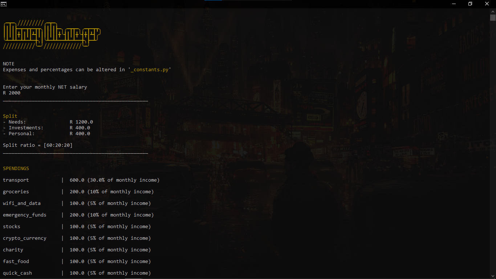

## Money Manager 

Description: <br>
A simple command-line program to divide your monthly-net-salary into various 
customisable portions.<br> 
Alterations can be made in '_constants.py'

GitHub repo: https://github.com/ammaar0x01/Py_money_manager

Language used: Python

Developer: ammaar0x01

Started:  12.06.25

Updated:  24.06.25

Version:  1.0.0

Branch:   Master

---

```
### Run the program ### 

## No command-line arguments 
python main.py 
# ----------------

## Using command-line arguments 
python main.py [verbose-mode]
# example 
python main.py verbose-mode
python main.py v

python main.py [net-monthly-salary]
# example  
python main.py 10000

python main.py [mode] [net-monthly-salary]
# example  
python main.py verbose-mode 10000
# ----------------
```
---


### Notes 
- You may need to create a directory called 'records' in the project directory 
- Install colorama if you do not have it 
```
pip install colorama 
```
---


### Screenshot 

---
